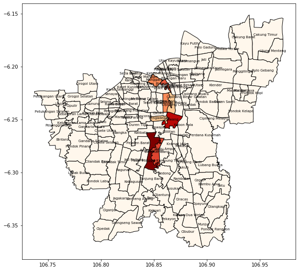

# INA-Geoparser
Hello,
We are releasing the first (Indonesian) Event Geoparser. This is to accompany our paper.  

Dewandaru, Agung, Dwi Hendratmo Widyantoro, and Saiful Akbar. "Event Geoparser with Pseudo-Location Entity Identification and Numerical Argument Extraction Implementation and Evaluation in Indonesian News Domain." ISPRS International Journal of Geo-Information 9.12 (2020): 712.

## contents
Corpus for Extended Geoparsing with Event Extraction (Indonesian): (train-test-v11/training.txt)  
Main Sources (egeoparser.py)  
Aggregated Topic Model (topicmerging.py) 
and its pretrained model (mergedtopics.pickle)  

## Requirements
This geoparser needs either sklearn-crfsuite or NCRF++ library.
If you want to use NCRF++, put the NCRF++ in the correct folder setup. 

## how to run

```
import inageoparser
test = """
Kali Ciliwung Meluap, 17 RW di 8 Kelurahan Jakarta Terendam Banjir

Sebanyak 17 RW yang tersebar di delapan kelurahan di Jakarta terendam banjir pada Selasa (19/5/2020) pagi
Ketinggian air antara 10 sentimeter sampai 100 sentimeter

Kepala Pusat Data dan Informasi Kebencanaan Badan Penanggulangan Bencana Daerah (BPBD) Jakarta M Insaf mengatakan, banjir disebabkan luapan Kali Ciliwung
 "Update pukul 03.00 WIB, ada 17 RW tergenang akibat luapan Kali Ciliwung," ujar Insaf saat dikonfirmasi
 Akibat banjir tersebut, ada 128 warga di Kelurahan Balekambang, Jakarta Timur, yang mengungsi di dua lokasi
 "Pengungsi 38 KK (kepala keluarga) dengan 128 jiwa, pos pengungsian dua lokasi di Balekambang," kata Insaf
 Berikut rincian banjir yang terjadi di Jakarta pada Selasa pagi ini:

4 RW di Kelurahan Kampung Melayu, Jakarta Timur, ketinggian air 10-50 sentimeter
2 RW di Kelurahan Bidara Cina, Jakarta Timur, ketinggian air 30-100 sentimeter
6 RW di Kelurahan Cawang, Jakarta Timur, ketinggian air 20-150 sentimeter
1 RW di Kelurahan Balekambang, Jakarta Timur, ketinggian air 40-100 sentimeter
1 RW di Kelurahan Pejaten Timur, Jakarta Selatan, ketinggian air 100 sentimeter
1 RW di Kelurahan Kebon Baru, Jakarta Selatan, ketinggian air 50 sentimeter
1 RW di Kelurahan Manggarai, Jakarta Selatan, ketinggian air 50 sentimeter
1 RW Kelurahan Pengadegan, Jakarta Selatan, ketinggian air 10-50 sentimeter

"""

# load the pre-trained model here
load_crf()
# do the parsing
predict(test)

```



